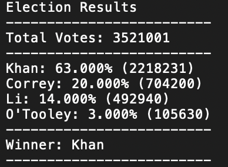

 

<H1>PyPoll</H1> 

## Objective

* Perfrom analysis on the given polling data csv <b>(election_data.csv)</b>
* The task is to create a Python script that analyzes the records to calculate each of the following and writes the analysis to a text file:

		1.) The total number of votes cast

		2.) A complete list of candidates who received votes

		3.) The percentage of votes each candidate won

		4.) The total number of votes each candidate won

		5.) The winner of the election based on popular vote.

##Technologies 

Code is written in Python 3. I used a jupyter notebook to perform the anlaysis. App can be performed in the terminal with Python 3 installed.  

##Results 
The resulted analysis is printed into a text file which will appear in your cloned repo. 
The analysis resulted in the following table: 
 

